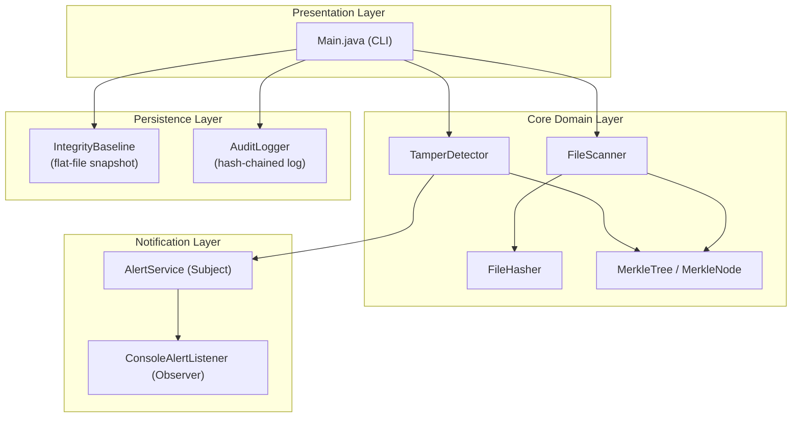
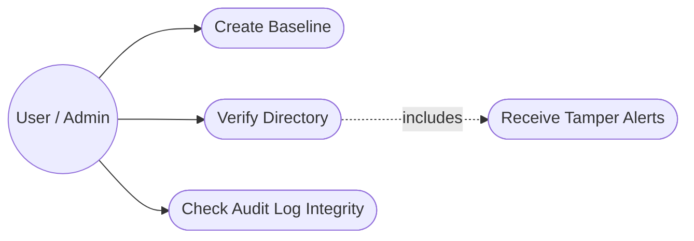
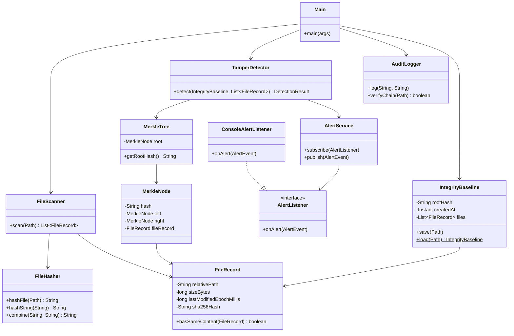
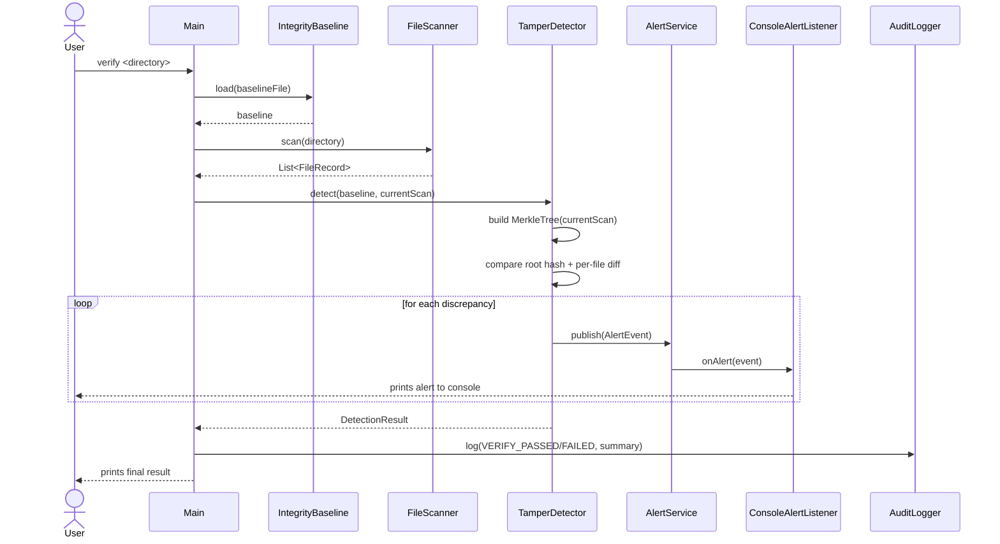
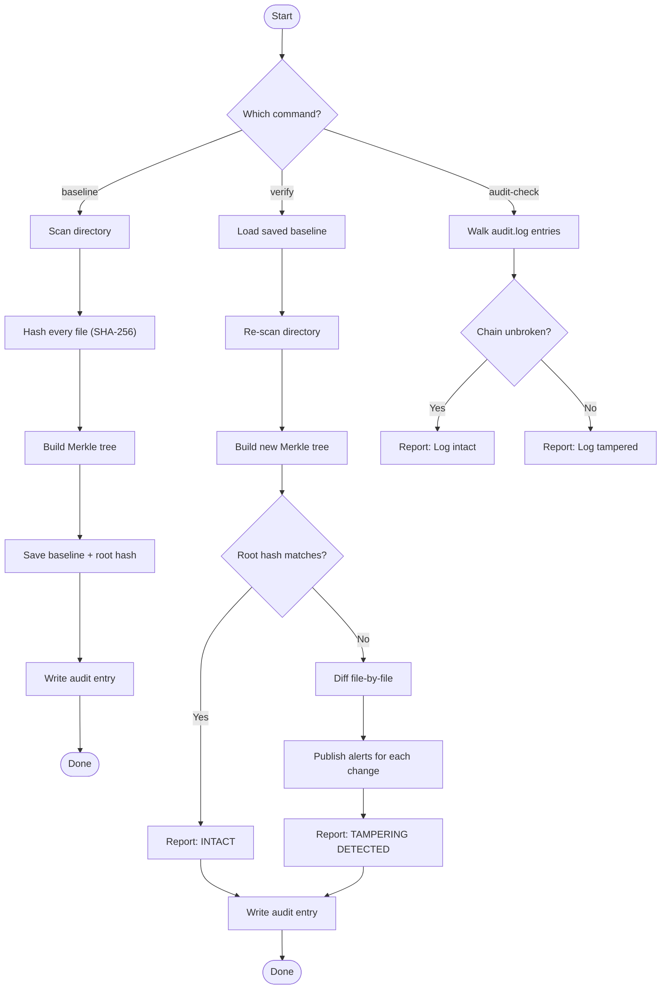

# Architecture & Design Diagrams

All diagrams below are written in [Mermaid](https://mermaid.js.org/) and render
automatically when this file is viewed on GitHub.

## 1. System Architecture

**Layering rationale:** the CLI never touches hashing or file I/O directly;
it only orchestrates calls to the domain layer. This keeps each module
independently testable (see `src/test`) and satisfies the Maintainability
non-functional requirement.

## 2. Use Case Diagram

## 3. Class Diagram (simplified)

## 4. Sequence Diagram — `verify` command

## 5. Process / Workflow Diagram

## 6. Why a Merkle Tree instead of a flat hash list?

| Approach | Detect *that* something changed | Detect *what* changed | Cost to re-verify a large tree |
|---|---|---|---|
| Flat list of file hashes | O(n) compare | O(n) compare | O(n) |
| Single hash of concatenated files | O(1) compare | Not possible without full re-scan | O(n) but no localization |
| **Merkle tree (this project)** | **O(1)** via root hash | **O(n)** with structural pruning possible | O(n) to build, O(log n) to prove a single file's inclusion |

The Merkle root gives an instant yes/no answer ("has anything in this
directory changed since baseline?"), while still allowing a full,
explainable diff when the answer is "yes" — which is what a real
tamper-detection tool needs to be useful rather than just alarming.
